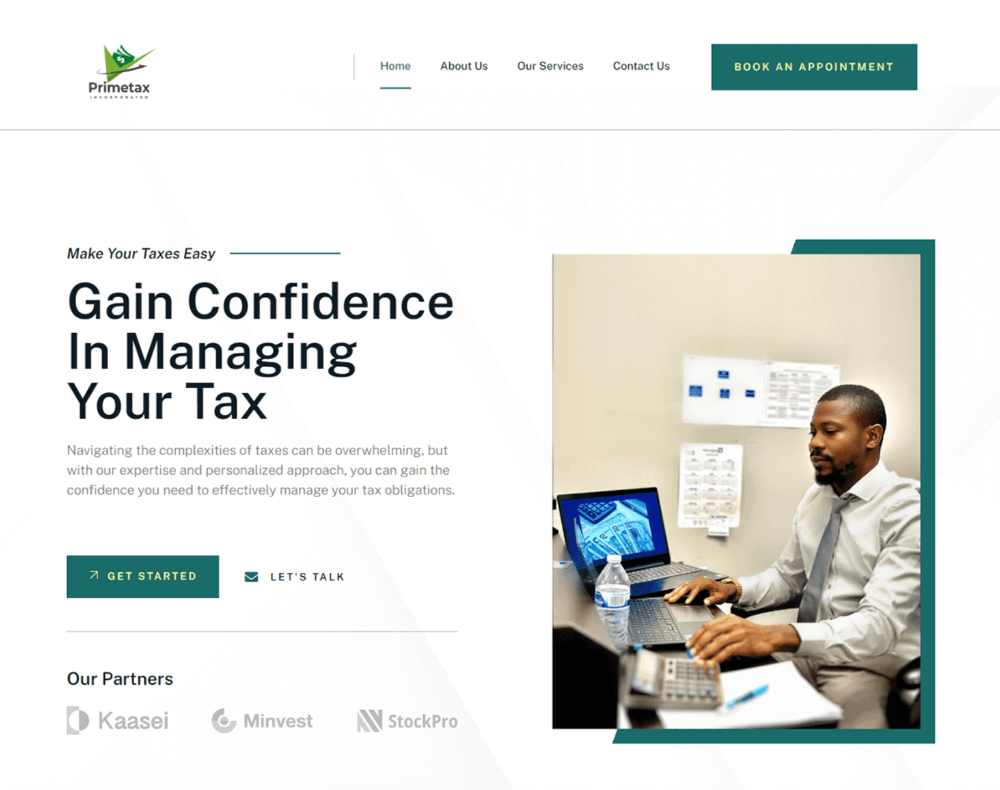

#  DGL103
## Final Project - Nicole Cahoon Wedsite Redesign

## Website link
Nicole Cahoon, CPA -  [http://nicolecahoon.com/] 

## Why the client needs a new website ?

- __What is the most important purpose of this website?__
The most important purpose of Nicole Cahoon's website is to showcase her professional services and expertise as a CPA (Certified Public Accountant). The website highlights her skills, qualifications, and the financial services she offers.

- __Who is the target audience?__
    - Small Business Owners
    - Entrepreneurs and Startups
    - Individuals
    - Corporate Clients
    - Potential Business Partners

- __What is the overall message to convey to your target audience on this website? What action do you want the audience to perform?__
    - The primary action would be encouraging visitors to reach out through contact forms, email, or phone for consultation or service inquiries.
    - Easy for booking a meeting or consultation.
    - Encourage visitors to explore detailed descriptions of her services.

    Multiple Ways to Take Action:
    - Direct Contact Form
    - Call-to-Action Buttons
    - Clickable Phone Number and Email
    - Social Media Links
    
- __Why is her current site not appropriate?__
There are some common issues that might need improvement:
    - Accessibility:
        - Color Contrast Issues: Insufficient contrast between text and background can make it difficult for visually impaired users to read content.
    - Speed: Slow Loading Times: Large images or unoptimized code can lead to slow page loading, which can frustrate users and increase bounce rates.
    - Cluttered Content: Overloaded pages with too much text or elements can overwhelm users and make the site less effective in delivering key messages.
    - Content:
        - Lack of Clear Messaging: If the content isn’t concise and informative, visitors may not understand Nicole’s expertise and services.    
        - Missing CTAs: Without strong call-to-action buttons or prompts, users may leave without engaging or taking the desired action.

## Look and feel :

The most appropriate mood for Nicole Cahoon's CPA website would be clean and professional. It ensures that potential clients feel confident in her skills and are encouraged to engage in her services.
- Minimalist Design: Keep the layout simple with organized sections.
- Neutral and Sophisticated Colors: Use a primary color like deep blue with a light gray background and subtle gold accents for highlights.
- Clear and Friendly Typography: Using professional serif font like Lora for headlines with a modern sans-serif like Roboto for body copy.

## Inspiration : 
- Homepage screenshots 

- Urls of 2 website designs
[Visit Ryan Tax Firm](https://ryan.com/canada/)
[Visit Grant Thornton](https://www.doanegrantthornton.ca/)

## Website Content

1. Home Page
    - Header: Include a clean logo and navigation bar with links to other pages.
    - Hero Section: Image or an impactful tagline that reflects Nicole Cahoon’s work.
    - Portfolio/Services Section: Showcase 2-3 highlighted services with a short description and a "Read More" button.
    - About Section: A brief paragraph introducing Nicole with a link to the About Me page for more details.
    - Call-to-action: Include heading and Link to Contact form.
    - Footer: Include navigation, social media links, contact information, and a brief copyright notice.

2. Portfolio/Services Page
    - Header: Include a clean logo and navigation bar with links to other pages.
    - Services List/description: E.g. "Individual Tax Services" | Description | [Read More], etc.
    - Clients testimonials: Short quotes from satisfied clients.
    - Footer: Include navigation, social media links, contact information, and a brief copyright notice.

3. About/Contact Us Page
    - Header: Include a clean logo and navigation bar with links to other pages.
    - About Section: Add an image of Nicole, small and concise bio that outlines her background, skills, and values.
    - Call-to-action: Include heading and Link to Contact page.
    - Footer: Include navigation, social media links, contact information, and a brief copyright notice.

